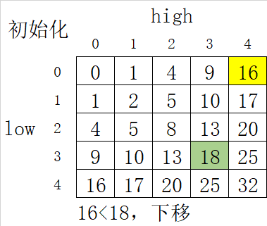

## [633. 平方数之和](https://leetcode.cn/problems/sum-of-square-numbers/)

[讨论](https://leetcode.cn/problems/sum-of-square-numbers/comments/) | [题解](https://leetcode.cn/problems/sum-of-square-numbers/solution/)

Tags: 快速幂 双指针

> 给定一个非负整数 c , 你要判断是否存在两个整数 a 和 b, 使得 a^2 + b^2 = c 。

```js
输入：c = 5
输出：true
解释：1 * 1 + 2 * 2 = 5
```

限制:
- 0 <= c <= 231 - 1

### 推导

基础思路：双指针向内收缩遍历, 直到找到解 或者 a > b；

```js
a = 0;
b = Math.floor(Math.sqrt(c));
```

这样初始化能保证 `a^2 + b^2 <= c`；当然大部分的时候都是 `a^2 + b^2 < c`;



可以将题目抽象成一个二维矩阵, 黄色格子表示当前的 `a^2 + b^2`, 绿色格子表示目标 `c`, 会发现如下的规律:

1. 初始化时黄色格子必定在矩阵的右上角, 因为 a = 0, b必然偏右来更加接近c.<br/>
2. 每次移动只会往左下角不断移动, 只有 `a++` 和 `b--` 两种选择.

所以当 `a^2 + b^2 < c` 时, 选择 `a++`<br/>
当 `a^2 + b^2 > c` 时, 选择 `b--` <br/>
这样一定不会错过正确答案！

### 题解
```js
/**
 * @param {number} c
 * @return {boolean}
 */
var judgeSquareSum = function(c) {
    const _c = Math.sqrt(c);
    let a = 0, b = Math.floor(_c);
    while(a <= b) {
        const result = a * a + b * b;
        if (result === c) return true;
        if (result < c) {
            a = a + 1;
        } else {
            b = b - 1;
        }
    }

    return false;
};
```
