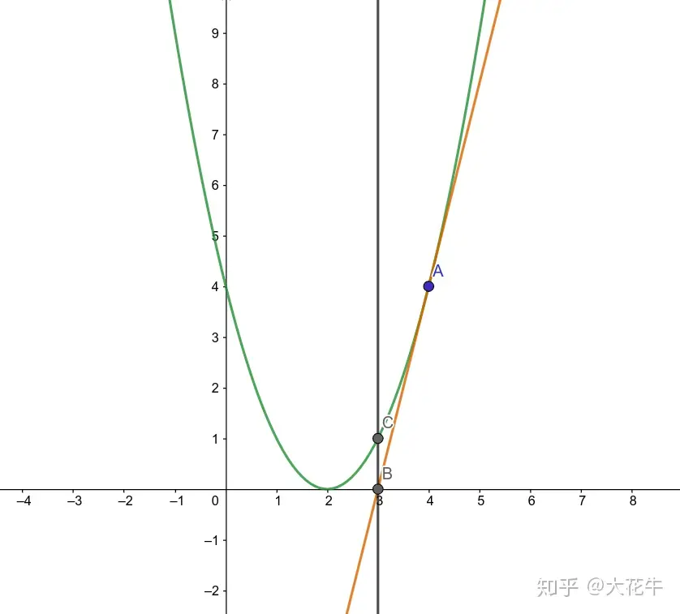

## 牛顿迭代法

计算某个数的开方值；

原理：<br/>
1. 在 f(x) = x^2 - a = 0 二元函数中，函数中某一点的切线 和 x轴 的交点，会比该点更加接近函数的解，如此反复下去，能够得到近视解；



```javascript
function mySqrt(a) {
  let x = a;
  while (x * x > a) x = (x + a / x) / 2;
  return (int)x;
}
```